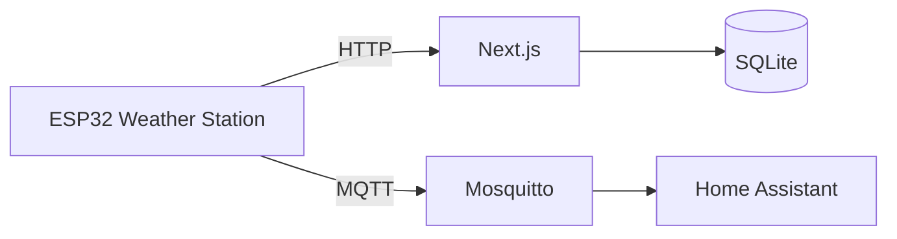

# Personal Weather Station

An open-source outdoor weather station built with an ESP32 and a self-hosted web application.

The weather station collects outdoor temperature, humidity, and atmospheric pressure. The ESP32 calculates dew point and heat index, then sends the data to the web application and MQTT.

## Features

* ESP32-based weather station
* DHT22 temperature and humidity sensor
* DPS310 pressure sensor
* Self-hosted Next.js dashboard
* SQLite data storage
* 24-hour weather history
* Celsius and Fahrenheit display
* MQTT support
* Home Assistant integration
* Designed for continuous operation

## Architecture



## Getting Started

### Web Application

```bash
cd web
npm install
npm run dev
```

The development server runs at:

```text
http://localhost:3000
```

### ESP32

The ESP32 firmware is located in:

```text
hardware/esp32/
```

See [`HARDWARE.md`](./HARDWARE.md) for the hardware setup and [`ARCHITECTURE.md`](./ARCHITECTURE.md) for the overall system design.

## Documentation

* [`ARCHITECTURE.md`](./docs/architecture.md) - System architecture
* [`HARDWARE.md`](./docs/hardware.md) - Hardware and sensor setup
* [`APIDOC.md`](./docs/apidoc.md) - API documentation

## License

See [`LICENSE`](./LICENSE).
