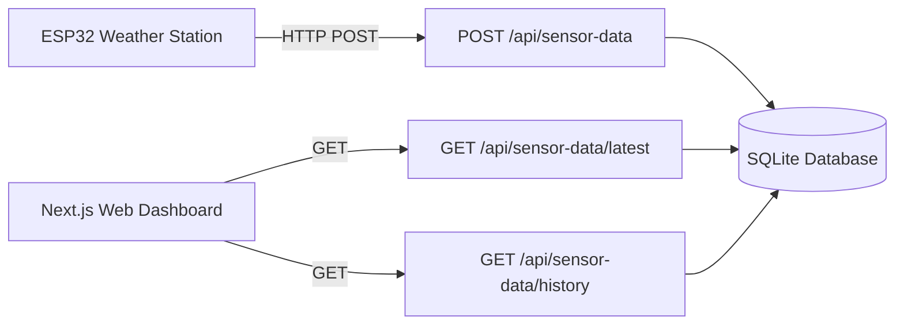
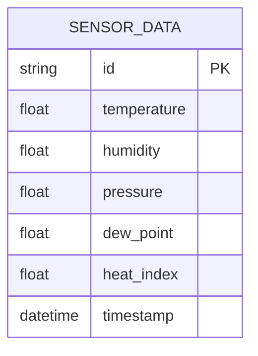
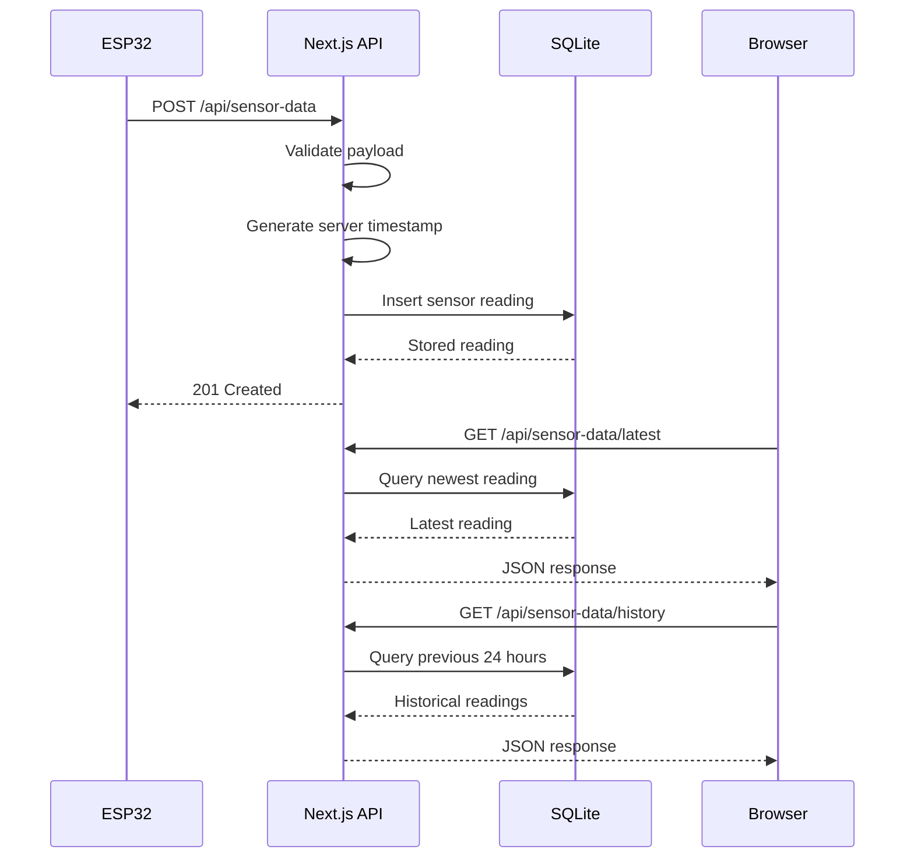
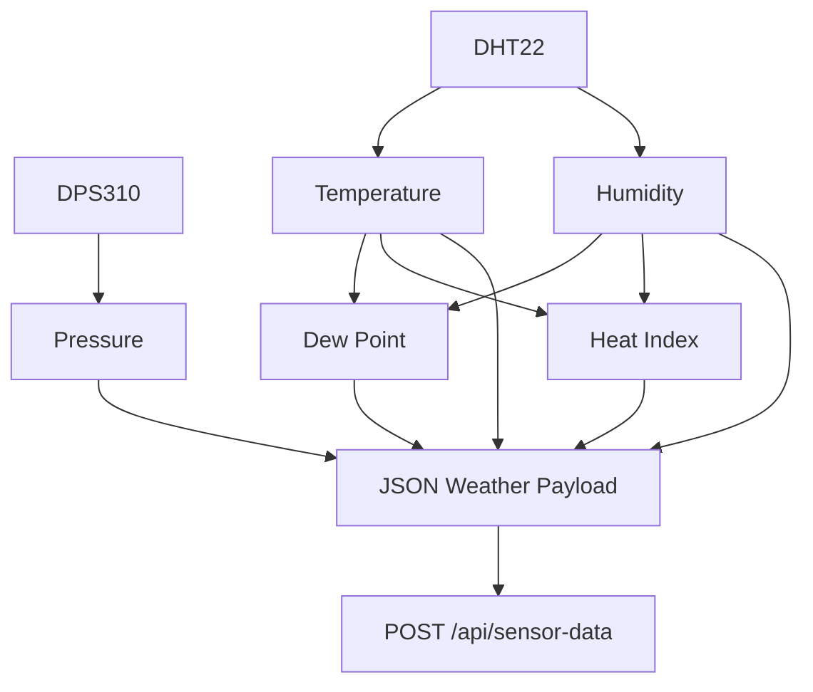
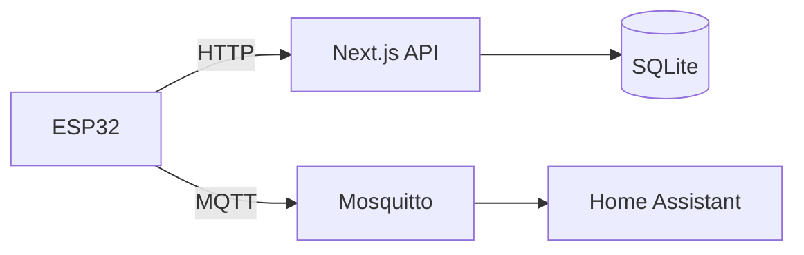

# API Documentation

## Overview

The Weather Station API is provided by the Next.js application.

The API sits between the ESP32 weather station and the SQLite database.

It provides endpoints for:

* Receiving sensor readings from the ESP32
* Retrieving the latest sensor reading
* Retrieving historical sensor readings



## Base URL

The API is served by the Next.js application.

For local development:

```text
http://localhost:3000
```

For example:

```text
http://localhost:3000/api/sensor-data
```

The production URL depends on how the application is deployed.


# Endpoints

## POST `/api/sensor-data`

Receives a weather reading from the ESP32 and stores it in SQLite.

### Request

```http
POST /api/sensor-data
Content-Type: application/json
```

### Request Body

```json
{
  "temperature": 19.60,
  "humidity": 62.60,
  "pressure": 1019.10,
  "dew_point": 12.26,
  "heat_index": null,
  "timestamp": "2026-09-07T22:09:12-0400"
}
```

### Request Fields

| Field         | Type             | Required | Description                                     |
| - | - | -- | -- |
| `temperature` | number           | Yes      | Ambient temperature in °C                       |
| `humidity`    | number           | Yes      | Relative humidity in %                          |
| `pressure`    | number           | Yes      | Atmospheric pressure in hPa                     |
| `dew_point`   | number           | Yes      | Dew point in °C                                 |
| `heat_index`  | number or `null` | Yes      | Heat index in °C, or `null` when not applicable |
| `timestamp`   | string           | No       | Timestamp generated by the ESP32                |

### Important Timestamp Behavior

The ESP32 includes a timestamp in its payload.

The API does **not** use this timestamp when storing the reading.

Instead, the server creates its own timestamp:

```text
timestamp = current server time
```

This makes the server the authoritative source for database timestamps.

The ESP32 timestamp remains part of the incoming payload but is currently ignored for persistence.

### Validation

The API validates incoming measurements before inserting them into the database.

#### Temperature

Temperature must be a valid number.

The current sanity range is:

```text
-100°C to 60°C
```

#### Humidity

Humidity must be a valid number between:

```text
0% and 100%
```

#### Pressure

Pressure must be a valid number.

#### Dew Point

Dew point must be a valid number.

#### Heat Index

Heat index must either be:

* A valid number
* `null`

### Successful Response

A successful request returns:

```http
201 Created
```

Example response:

```json
{
  "id": "c2b6c8e1-8c4d-4e9b-a7e3-123456789abc",
  "temperature": 19.6,
  "humidity": 62.6,
  "pressure": 1019.1,
  "dewPoint": 12.26,
  "heatIndex": null,
  "timestamp": "2026-09-07T22:09:14.321Z"
}
```

The response timestamp is the server-generated database timestamp.

### Error Responses

#### `400 Bad Request`

Returned when one or more values fail validation.

Example:

```json
{
  "error": "temperature, humidity, pressure, and dew_point must be valid numbers"
}
```

Invalid humidity example:

```json
{
  "error": "humidity must be between 0 and 100"
}
```

Invalid heat index example:

```json
{
  "error": "heat_index must be a number or null"
}
```

#### `500 Internal Server Error`

Returned when the server cannot process or store the reading.

Example:

```json
{
  "error": "Failed to save sensor data"
}
```


# GET `/api/sensor-data/latest`

Returns the most recently stored weather reading.

### Request

```http
GET /api/sensor-data/latest
```

No request body is required.

### Successful Response

```http
200 OK
```

Example:

```json
{
  "id": "c2b6c8e1-8c4d-4e9b-a7e3-123456789abc",
  "temperature": 19.6,
  "humidity": 62.6,
  "pressure": 1019.1,
  "dewPoint": 12.26,
  "heatIndex": null,
  "timestamp": "2026-09-07T22:09:14.321Z"
}
```

### Response Fields

| Field         | Type             | Description                 |
| - | - |  |
| `id`          | string           | Unique database identifier  |
| `temperature` | number           | Ambient temperature in °C   |
| `humidity`    | number           | Relative humidity in %      |
| `pressure`    | number           | Atmospheric pressure in hPa |
| `dewPoint`    | number           | Dew point in °C             |
| `heatIndex`   | number or `null` | Heat index in °C            |
| `timestamp`   | string           | Server-generated timestamp  |

### No Data

If the database does not contain any readings:

```http
404 Not Found
```

Response:

```json
{
  "error": "No sensor data available"
}
```

### Server Error

If the database cannot be queried:

```http
500 Internal Server Error
```

Response:

```json
{
  "error": "Failed to fetch sensor data"
}
```


# GET `/api/sensor-data/history`

Returns weather readings from the previous 24 hours.

### Request

```http
GET /api/sensor-data/history
```

No request body is required.

### Time Range

The API calculates the beginning of the history window using the server's current time:

```text
current server time - 24 hours
```

Readings at or after that timestamp are returned.

### Successful Response

```http
200 OK
```

Example:

```json
[
  {
    "temperature": 18.9,
    "humidity": 65.2,
    "pressure": 1018.7,
    "dewPoint": 12.1,
    "heatIndex": null,
    "timestamp": "2026-09-07T21:00:00.000Z"
  },
  {
    "temperature": 19.6,
    "humidity": 62.6,
    "pressure": 1019.1,
    "dewPoint": 12.26,
    "heatIndex": null,
    "timestamp": "2026-09-07T22:00:00.000Z"
  }
]
```

Results are returned in chronological order from oldest to newest.

### Response Fields

| Field         | Type             | Description                 |
| - | - |  |
| `temperature` | number           | Ambient temperature in °C   |
| `humidity`    | number           | Relative humidity in %      |
| `pressure`    | number           | Atmospheric pressure in hPa |
| `dewPoint`    | number           | Dew point in °C             |
| `heatIndex`   | number or `null` | Heat index in °C            |
| `timestamp`   | string           | Server-generated timestamp  |

### Server Error

If the database cannot be queried:

```http
500 Internal Server Error
```

Response:

```json
{
  "error": "Failed to fetch sensor history"
}
```


# Data Model

The API is backed by the `SensorData` database model.



The corresponding database table is:

```text
sensor_data
```

The timestamp column has an index to improve time-based queries.


# Data Conventions

## Temperature

Temperature is stored and transmitted by the API in Celsius.

```text
°C
```

The web application may convert Celsius to Fahrenheit for display.

The API does not accept or return a temperature unit parameter.

## Humidity

Humidity is represented as relative humidity in percent.

```text
0 to 100
```

For example:

```text
62.6
```

represents:

```text
62.6%
```

## Pressure

Atmospheric pressure is represented in hectopascals.

```text
hPa
```

For example:

```text
1019.1
```

represents:

```text
1019.1 hPa
```

## Dew Point

Dew point is supplied by the ESP32 and stored in Celsius.

The API does not recalculate dew point.

## Heat Index

Heat index is supplied by the ESP32 and stored in Celsius.

When heat index is not applicable, the value is:

```json
null
```

The API preserves `null` rather than calculating a replacement value.


# API Data Flow




# ESP32 Integration

The ESP32 sends a single weather payload containing all currently supported measurements.



The API does not perform weather calculations.

The ESP32 is responsible for:

* Sensor acquisition
* Dew point calculation
* Heat index calculation

The API is responsible for:

* Validation
* Persistence
* Retrieval


# MQTT and API Separation

MQTT is independent of the HTTP API.

The ESP32 sends weather data through both paths:



The MQTT path does not write to SQLite.

The HTTP API does not depend on MQTT.

This separation allows either system to continue serving its own purpose independently.


# API Design Principles

The API follows several design principles:

1. **The ESP32 owns sensor calculations.**
   Derived weather values are calculated before transmission.

2. **The server owns timestamps.**
   Database timestamps are generated when readings reach the API.

3. **The server owns persistence.**
   The ESP32 does not interact directly with SQLite.

4. **The frontend owns presentation.**
   Temperature unit conversion is handled by the web application.

5. **HTTP and MQTT remain independent.**
   The dashboard does not depend on MQTT, and Home Assistant does not depend on the Next.js API.

6. **The API remains intentionally small.**
   The current API only exposes the operations required by the weather station and dashboard.


# Current Endpoints

| Method | Endpoint                   | Purpose                                    |
|  | -- |  |
| `POST` | `/api/sensor-data`         | Store a new sensor reading                 |
| `GET`  | `/api/sensor-data/latest`  | Retrieve the newest sensor reading         |
| `GET`  | `/api/sensor-data/history` | Retrieve the previous 24 hours of readings |
