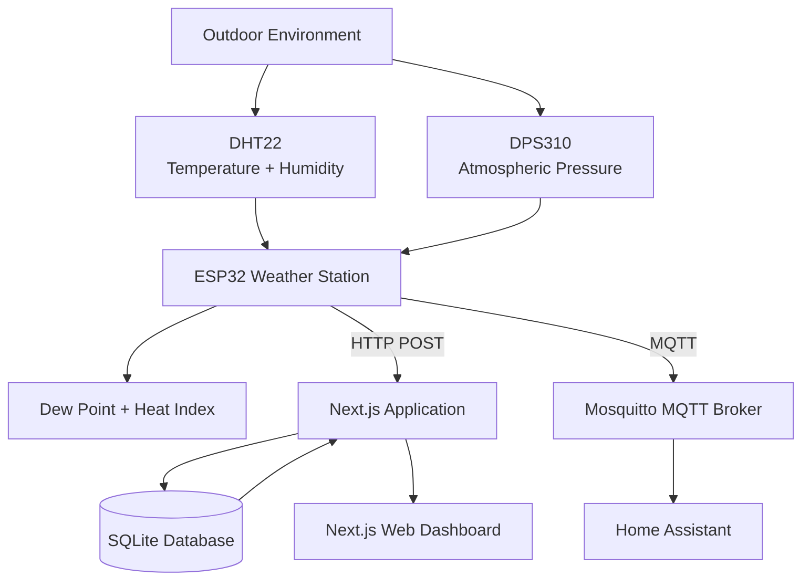
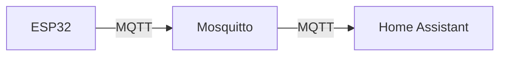

# Weather Station Architecture

## Overview

This project is an open-source outdoor weather station built around an ESP32, a self-hosted Next.js application, SQLite, MQTT, and Home Assistant.

The system has two independent data paths:

1. **HTTP path** for storing sensor data and displaying it in the web dashboard.
2. **MQTT path** for integrating the weather station with Home Assistant.

The ESP32 is responsible for reading the sensors and calculating derived weather values. The Next.js application is responsible for receiving, storing, and displaying those values.



## Components

### ESP32 Weather Station

The ESP32 is the physical weather station controller.

It reads:

* **DHT22**

  * Ambient temperature
  * Relative humidity
  * Connected to GPIO 13

* **DPS310**

  * Atmospheric pressure
  * I2C SDA on GPIO 32
  * I2C SCL on GPIO 33

The DPS310's internal temperature reading is not used as the outdoor ambient temperature. The DHT22 is the dedicated ambient temperature and humidity sensor and is installed in a Stevenson screen.

The ESP32 calculates:

* Dew point
* Heat index

These derived values are calculated on the ESP32 so that the same values can be sent through both the HTTP and MQTT paths.

The ESP32 sends data approximately once per minute.

### Next.js Application

The Next.js application provides both the backend API and the web interface.

It is responsible for:

* Receiving sensor data from the ESP32
* Validating incoming sensor data
* Storing sensor readings in SQLite
* Providing the latest reading through an API endpoint
* Providing historical readings through an API endpoint
* Serving the weather dashboard
* Converting displayed temperature values between Celsius and Fahrenheit

The Next.js application does not recalculate dew point or heat index. Those values are received from the ESP32.

### SQLite

SQLite is used as the persistent weather database.

The database stores individual sensor readings in the `sensor_data` table.

Each reading contains:

* Temperature
* Relative humidity
* Atmospheric pressure
* Dew point
* Heat index
* Server-generated timestamp

The server generates the timestamp when the reading is received. The timestamp supplied by the ESP32 is not used for database storage.

An index is maintained on the timestamp column to support historical queries efficiently.

The database is suitable for the current sampling rate of approximately one reading per minute.

At that rate, the system produces approximately:

```text
60 × 24 × 365 = 525,600 readings per year
```

### MQTT

MQTT provides a separate integration path for Home Assistant.

The ESP32 publishes the same sensor payload used by the HTTP endpoint to the MQTT broker.

The current MQTT topic is:

```text
sensors/esp32-weather-01/state
```

The MQTT broker is Mosquitto.

MQTT is intentionally kept separate from the Next.js application's database path. Home Assistant can consume MQTT data without depending on the Next.js application.

The ESP32 does not use MQTT Discovery. Home Assistant MQTT configuration is managed separately from the ESP32 firmware.

### Home Assistant

Home Assistant consumes weather data from the MQTT broker.

The Home Assistant integration is independent of the Next.js dashboard.

This allows the weather station to be used in Home Assistant automations, dashboards, and other integrations without requiring the web application to be running.

### Web Dashboard

The web dashboard is built with Next.js and Mantine.

The dashboard displays:

* Current temperature
* Humidity
* Atmospheric pressure
* Dew point
* Heat index when available
* Connection status
* Last update time
* Historical temperature and dew point
* Historical humidity
* Historical pressure

Temperature values can be displayed in either:

* Celsius
* Fahrenheit

The database and API continue to use the original metric values regardless of the selected display unit.

The temperature unit preference is stored locally in the browser.

## Data Flow

### HTTP Data Flow

The ESP32 sends an HTTP POST request to:

```text
POST /api/sensor-data
```

The payload contains:

```json
{
  "temperature": 19.60,
  "humidity": 62.60,
  "pressure": 1019.10,
  "dew_point": 12.26,
  "heat_index": null,
  "timestamp": "2026-09-07T22:09:12-0400"
}
```

The Next.js API:

1. Parses the JSON request.
2. Validates the sensor values.
3. Creates a server-side timestamp.
4. Stores the reading in SQLite.
5. Returns HTTP `201 Created`.

The timestamp supplied by the ESP32 is currently accepted as part of the payload but is not used as the database timestamp.

### Latest Data Flow

The dashboard retrieves the most recent reading through:

```text
GET /api/sensor-data/latest
```

The API queries SQLite and returns the newest sensor reading based on the server-generated timestamp.

### Historical Data Flow

The dashboard retrieves the previous 24 hours of sensor data through:

```text
GET /api/sensor-data/history
```

The API returns the historical readings ordered chronologically.

The API returns all weather measurements needed by the dashboard and future charts.

### MQTT Data Flow

The ESP32 publishes sensor readings to:

```text
sensors/esp32-weather-01/state
```

Mosquitto receives the message and makes it available to subscribed clients.

Home Assistant consumes the MQTT data independently of the Next.js application.



## Sensor Responsibilities

The ESP32 is responsible for physical sensor acquisition and weather calculations.

| Value       | Source                 | Calculated by |
| ----------- | ---------------------- | ------------- |
| Temperature | DHT22                  | ESP32         |
| Humidity    | DHT22                  | ESP32         |
| Pressure    | DPS310                 | ESP32         |
| Dew point   | DHT22 data             | ESP32         |
| Heat index  | Temperature + humidity | ESP32         |

The DPS310 temperature value is intentionally excluded from the weather data because it represents the sensor's internal temperature rather than the outdoor ambient temperature.

## API Responsibilities

The Next.js API acts as the boundary between the ESP32 and the database.

It performs basic validation before inserting readings.

Current validation includes:

* Temperature must be numeric.
* Humidity must be numeric.
* Pressure must be numeric.
* Dew point must be numeric.
* Heat index must be numeric or `null`.
* Humidity must be between 0 and 100%.
* Temperature must be within the configured sanity range.

The API generates the database timestamp using the server's current time.

## Database Responsibilities

The database stores raw sensor readings and derived values exactly as received from the ESP32.

The database does not calculate:

* Dew point
* Heat index
* Temperature conversions

This keeps the database as a record of what the weather station actually reported.

Temperature unit conversion is performed only when preparing values for display in the browser.

## Frontend Responsibilities

The browser is responsible for presentation.

The frontend:

* Retrieves data from the Next.js API.
* Displays current conditions.
* Displays historical charts.
* Converts Celsius to Fahrenheit when requested.
* Persists the user's temperature unit preference locally.
* Applies visual temperature thresholds.

The underlying database remains metric regardless of the selected display unit.

## Temperature Display

The weather station stores temperature in Celsius.

When Fahrenheit is selected, the frontend converts:

```text
°F = (°C × 9 / 5) + 32
```

Temperature color thresholds are based on the original Celsius measurement rather than the displayed value.

Current thresholds are:

```text
Below 10°C       Deep blue
10°C to 30°C     Teal
Above 30°C       Red
```

This prevents the visual thresholds from changing meaning when the user switches between Celsius and Fahrenheit.

## Reliability

The ESP32 attempts to reconnect to Wi-Fi when connectivity is lost.

MQTT connectivity is handled independently from HTTP communication.

An HTTP failure does not intentionally stop the weather station. The ESP32 continues operating and attempting future readings.

The Next.js API returns appropriate HTTP error responses when requests cannot be validated or stored.

## Security Considerations

The MQTT broker requires authentication.

The ESP32 MQTT connection uses a dedicated MQTT username and password.

The MQTT broker is configured with anonymous access disabled.

The current ESP32 firmware contains connection configuration directly in the firmware. Separating credentials into a configuration header is a future cleanup step and is not currently part of the implementation.

Environment-specific Next.js configuration, including the SQLite database location, is kept outside the source-controlled application code.

## Deployment Model

The intended deployment is a self-hosted always-on media server.

The Next.js application, SQLite database, Mosquitto broker, and Home Assistant can operate on the same physical server or within the same home network.

The ESP32 communicates with the server over the local network.

A production deployment should keep the SQLite database outside the application source tree, for example:

```text
/var/lib/weather-station/weather.db
```

This separates application code from persistent application data.


## Repository Structure

The project is organized by major responsibility:

```text
weather-station/
├── hardware/
│   ├── esp32/
│   │   ├── weather-station.ino
│   │   ├── config.example.h
│   │   └── README.md
│   ├── raspberry-pi/
│   └── arduino/
│
├── web/
│   ├── src/
│   │   ├── app/
│   │   │   └── api/
│   │   │       └── sensor-data/
│   │   ├── components/
│   │   ├── lib/
│   │   └── types/
│   ├── public/
│   ├── prisma/
│   │   ├── migrations/
│   │   └── schema.prisma
│   └── ...
│
├── docs/
│
├── ARCHITECTURE.md
├── README.md
└── LICENSE
```

## Design Principles

The project follows several simple architectural principles:

1. **Keep sensor logic on the ESP32.**
   The ESP32 reads the sensors and calculates derived weather values.

2. **Keep persistence on the server.**
   The Next.js API owns database writes.

3. **Keep presentation in the frontend.**
   Unit conversion and visualization are frontend concerns.

4. **Keep MQTT independent.**
   Home Assistant integration should not depend on the web dashboard.

5. **Use one source of truth for stored weather data.**
   SQLite stores the readings received by the server.

6. **Avoid unnecessary complexity.**
   Next.js provides the application, API, and frontend without introducing a separate backend service.

7. **Keep the hardware integration flexible.**
   The ESP32 can publish through HTTP and MQTT without either system being required for the other to function.
