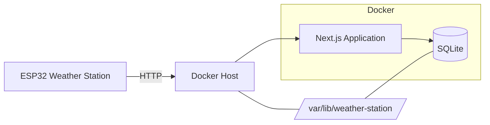

# Deployment

This document describes how to deploy the weather station web application using Docker.

## Requirements

The deployment machine should have:

* Docker
* Docker Compose
* Git
* Network access to the ESP32

The machine should remain powered on and connected to the local network.

## Clone the Repository

Clone the repository:

```bash
git clone <repository-url>
cd weather-station
```

## Configure Persistent Storage

The SQLite database should be stored outside the Docker container so that it survives container recreation and application updates.

Create the database directory:

```bash
sudo mkdir -p /var/lib/weather-station
```

Give the current user ownership:

```bash
sudo chown -R $USER:$USER /var/lib/weather-station
```

## Configure Environment Variables

Create the production environment file:

```bash
cd web
nano .env
```

Set the database location:

```env
DATABASE_URL="file:/data/weather.db"
```

The `.env` file should not be committed to Git.

Return to the repository root:

```bash
cd ..
```

## Docker Compose

The repository includes a `compose.yaml` file that runs the web application.

A basic configuration is:

```yaml
services:
  weather-station:
    build:
      context: ./web
    container_name: weather-station
    restart: unless-stopped

    ports:
      - "3000:3000"

    env_file:
      - ./web/.env

    volumes:
      - /var/lib/weather-station:/data
```

The `/var/lib/weather-station` directory on the host is mounted as `/data` inside the container.

This keeps the SQLite database persistent across container rebuilds and updates.

## Build and Start

From the repository root:

```bash
docker compose up -d --build
```

Check that the container is running:

```bash
docker compose ps
```

View application logs:

```bash
docker compose logs -f weather-station
```

The dashboard should now be available at:

```text
http://<server-ip>:3000
```

For example:

```text
http://192.168.1.100:3000
```

## Verify the Deployment

After starting the application, verify:

1. The dashboard loads.
2. The application can access SQLite.
3. The ESP32 can reach the server.
4. Sensor data is received at:

```text
POST /api/sensor-data
```

5. The latest data endpoint returns data:

```text
GET /api/sensor-data/latest
```

6. Historical data is available:

```text
GET /api/sensor-data/history
```

## ESP32 Configuration

Configure the ESP32 firmware to send HTTP data to the Docker host.

The API endpoint is:

```text
http://<server-ip>:3000/api/sensor-data
```

The ESP32 does not need access to the SQLite database or the Docker container directly.

It only needs network access to the server's HTTP port.

## Updating the Application

Pull the latest changes:

```bash
git pull
```

Rebuild and restart the container:

```bash
docker compose up -d --build
```

Check the deployment:

```bash
docker compose ps
```

View logs:

```bash
docker compose logs -f weather-station
```

The SQLite database remains in:

```text
/var/lib/weather-station/weather.db
```

and is not replaced by the container rebuild.

## Stopping the Application

Stop the application:

```bash
docker compose down
```

This removes the container but does not remove the persistent database.

Start it again with:

```bash
docker compose up -d
```

## Restarting the Application

To restart the container without rebuilding:

```bash
docker compose restart
```

## Database Backups

The SQLite database contains the weather history and should be backed up regularly.

The database is located on the host at:

```text
/var/lib/weather-station/weather.db
```

A SQLite-safe backup can be created with:

```bash
sqlite3 /var/lib/weather-station/weather.db \
  ".backup '/var/backups/weather-station/weather.db'"
```

Create the backup directory if necessary:

```bash
sudo mkdir -p /var/backups/weather-station
```

For long-term deployments, automate backups and retain multiple backup copies.

## Docker Restart Policy

The Compose configuration uses:

```yaml
restart: unless-stopped
```

This allows Docker to automatically restart the application after:

* Application crashes
* Container restarts
* Docker daemon restarts
* Host reboots

The application remains stopped only when explicitly stopped by the user.

## Network Access

The application listens on port `3000`.

If the server uses a firewall, allow access to the port from the local network as required.

The application should not be exposed directly to the public internet unless appropriate security measures are in place.

For internet-facing deployments, use a reverse proxy and HTTPS.

## Deployment Checklist

* [ ] Docker is installed
* [ ] Docker Compose is available
* [ ] Repository is cloned
* [ ] `/var/lib/weather-station` exists
* [ ] `web/.env` is configured
* [ ] `DATABASE_URL` points to `/data/weather.db`
* [ ] Docker image builds successfully
* [ ] Container starts successfully
* [ ] Dashboard is accessible
* [ ] ESP32 can reach the API
* [ ] Sensor data is stored
* [ ] Container restart policy is enabled
* [ ] Database backups are configured

## Architecture



The Docker container runs the Next.js application and Prisma.

The SQLite database is stored on the Docker host and mounted into the container as persistent storage.

The ESP32 communicates with the Next.js application over HTTP.
