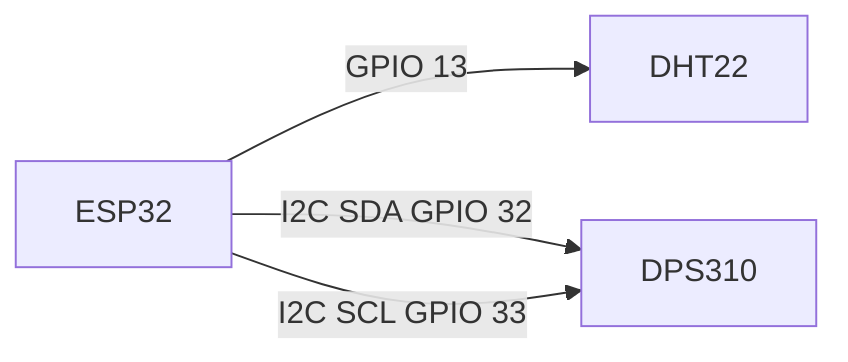
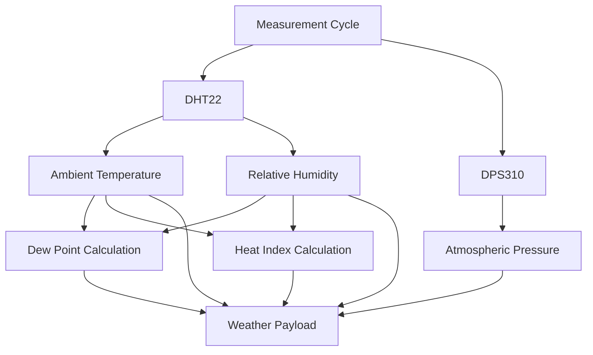
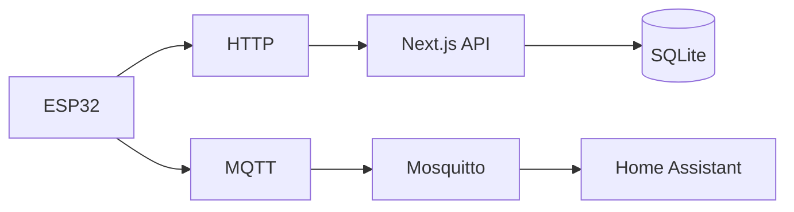
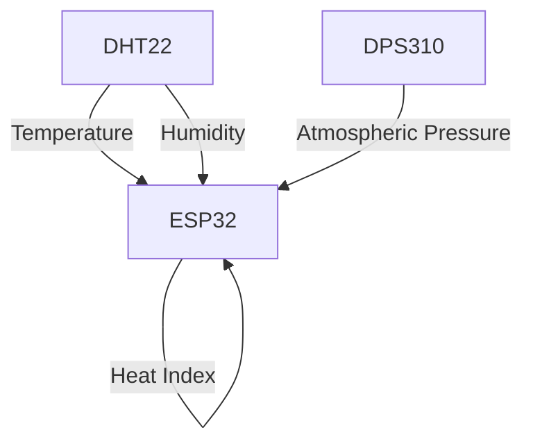

# Hardware

## Overview

This project uses an ESP32 as the main weather station controller.

The ESP32 collects outdoor temperature, relative humidity, and atmospheric pressure. It also calculates dew point and heat index before sending the readings to the server and MQTT broker.

The temperature and humidity sensor is installed inside a Stevenson screen to provide a more representative measurement of outdoor ambient conditions.

## Hardware Components

### ESP32

The ESP32 is responsible for:

* Reading the connected sensors
* Calculating dew point
* Calculating heat index
* Connecting to Wi-Fi
* Sending weather data to the Next.js server over HTTP
* Publishing weather data through MQTT
* Maintaining the measurement loop

The current firmware sends a weather reading approximately once every 60 seconds.

### DHT22

The DHT22 provides:

* Ambient temperature
* Relative humidity

Connection:

| DHT22 | ESP32   |
| ----- | ------- |
| VCC   | 3.3V    |
| GND   | GND     |
| DATA  | GPIO 13 |

The DHT22 is the authoritative source for outdoor ambient temperature and humidity.

The sensor is installed in a Stevenson screen to protect it from direct environmental exposure while allowing airflow around the sensor.

### DPS310

The DPS310 provides atmospheric pressure.

Connection:

| DPS310 | ESP32   |
| ------ | ------- |
| SDA    | GPIO 32 |
| SCL    | GPIO 33 |
| VCC    | 3.3V    |
| GND    | GND     |

The DPS310 communicates with the ESP32 using I2C.

The DPS310 also provides an internal temperature measurement. This value is intentionally not used as the outdoor ambient temperature.

The DHT22 is used for ambient temperature.

The DPS310 temperature measurement is relevant to the operation and compensation of the pressure sensor, but it is not treated as a weather station ambient temperature measurement.

## Wiring

The current sensor wiring is:



### DHT22 Wiring

```text
DHT22
┌─────────────┐
│ VCC  ───────┼── 3.3V
│ DATA ───────┼── GPIO 13
│ GND  ───────┼── GND
└─────────────┘
```

### DPS310 Wiring

```text
DPS310
┌─────────────┐
│ VCC  ───────┼── 3.3V
│ SDA  ───────┼── GPIO 32
│ SCL  ───────┼── GPIO 33
│ GND  ───────┼── GND
└─────────────┘
```

## Sensor Data Flow

The ESP32 reads both sensors during each measurement cycle.



## Measurements

The weather station currently produces the following values.

| Measurement | Unit | Source            |
| ----------- | ---- | ----------------- |
| Temperature | °C   | DHT22             |
| Humidity    | %    | DHT22             |
| Pressure    | hPa  | DPS310            |
| Dew point   | °C   | ESP32 calculation |
| Heat index  | °C   | ESP32 calculation |

The ESP32 sends these values as part of a single weather payload.

## Dew Point

Dew point is calculated on the ESP32 using the Magnus approximation.

The calculation uses:

* Ambient temperature from the DHT22
* Relative humidity from the DHT22

The resulting dew point is included in the payload sent to both HTTP and MQTT.

The Next.js application does not recalculate dew point.

## Heat Index

Heat index is calculated on the ESP32 using the NOAA/NWS Rothfusz methodology.

The calculation uses:

* Ambient temperature
* Relative humidity

Heat index is only considered meaningful when the environmental conditions meet the applicable heat index criteria.

When the heat index is not applicable, the ESP32 sends:

```json
{
  "heat_index": null
}
```

The Next.js application preserves this value rather than attempting to calculate it again.

## Weather Payload

The ESP32 uses the same logical payload for both HTTP and MQTT.

Example:

```json
{
  "temperature": 19.60,
  "humidity": 62.60,
  "pressure": 1019.10,
  "dew_point": 12.26,
  "heat_index": null,
  "timestamp": "2026-09-07T22:09:12-0400"
}
```

### Fields

| Field         | Description                                   |
| ------------- | --------------------------------------------- |
| `temperature` | Ambient temperature from the DHT22            |
| `humidity`    | Relative humidity from the DHT22              |
| `pressure`    | Atmospheric pressure from the DPS310          |
| `dew_point`   | Dew point calculated by the ESP32             |
| `heat_index`  | Heat index calculated by the ESP32, or `null` |
| `timestamp`   | ESP32 timestamp included in the payload       |

The server currently generates its own timestamp when storing the reading. The timestamp supplied by the ESP32 is not used as the database timestamp.

## Communication

The ESP32 communicates with the rest of the system over the local network.

There are two independent communication paths.



### HTTP

The ESP32 sends readings to:

```text
POST /api/sensor-data
```

The HTTP path is used for persistent storage and the Next.js dashboard.

### MQTT

The ESP32 publishes readings to:

```text
sensors/esp32-weather-01/state
```

The MQTT path is used for Home Assistant integration.

MQTT Discovery is not implemented in the ESP32 firmware. Home Assistant configuration is handled separately.

## Measurement Interval

The firmware uses a measurement interval of approximately:

```text
60 seconds
```

The first sensor reading is performed immediately after initialization.

Subsequent readings occur approximately once per minute.

This produces approximately:

```text
1,440 readings per day
525,600 readings per year
```

assuming continuous operation.

## Power and Environment

The weather station hardware is intended for outdoor environmental monitoring.

The DHT22 should remain protected from:

* Direct precipitation
* Direct sunlight
* Excessive condensation

The current installation uses a Stevenson screen around the DHT22.

The ESP32 and other electronics should be housed in an appropriate weather-protected enclosure.

The electronics enclosure and power system are separate considerations from the sensor installation.

## Firmware

The primary ESP32 firmware is located at:

```text
hardware/esp32/weather-station.ino
```

The firmware is responsible for:

1. Initializing the ESP32.
2. Connecting to Wi-Fi.
3. Initializing the DHT22.
4. Initializing the DPS310.
5. Synchronizing time through NTP.
6. Reading the sensors.
7. Calculating dew point.
8. Calculating heat index.
9. Sending the reading through HTTP.
10. Publishing the reading through MQTT.
11. Reconnecting to Wi-Fi or MQTT when necessary.
12. Repeating the measurement cycle.

## Pin Assignment

The current GPIO assignments are:

| Function   | ESP32 GPIO |
| ---------- | ---------: |
| DHT22 data |         13 |
| DPS310 SDA |         32 |
| DPS310 SCL |         33 |

The ESP32 uses the default I2C bus configured with the specified SDA and SCL pins.

## Libraries

The current firmware uses the following Arduino libraries:

* `WiFi`
* `HTTPClient`
* `PubSubClient`
* `Wire`
* `DHT`
* `Adafruit_DPS310`
* `time`
* `math`

These libraries provide network connectivity, HTTP communication, MQTT communication, I2C communication, sensor access, time synchronization, and mathematical functions.

## Sensor Responsibilities

The responsibilities of each hardware component are intentionally separated.



The DHT22 owns ambient temperature and humidity measurements.

The DPS310 owns atmospheric pressure measurements.

The ESP32 combines those measurements to calculate derived weather values.

## Future Hardware Expansion

The current design leaves room for additional hardware and sensors.

Potential future additions could include:

* Wind speed
* Wind direction
* Rainfall
* Solar radiation
* UV index
* Soil temperature
* Soil moisture
* Additional temperature or humidity sensors

Any additional sensor should have a clearly defined responsibility and data source.

New measurements should be added to the system without changing the meaning of the existing sensor fields.

## Hardware Design Principles

The hardware design follows several principles:

1. **Use dedicated sensors for dedicated measurements.**
   The DHT22 provides outdoor ambient temperature and humidity, while the DPS310 provides atmospheric pressure.

2. **Keep derived calculations on the ESP32.**
   Dew point and heat index are calculated where the source measurements are collected.

3. **Keep communication independent.**
   HTTP and MQTT provide separate paths for different consumers.

4. **Avoid unnecessary dependencies.**
   The ESP32 communicates directly with the Next.js API and MQTT broker.

5. **Protect outdoor sensors from the environment.**
   The DHT22 is installed in a Stevenson screen.

6. **Keep the hardware extensible.**
   Additional environmental sensors can be added without changing the fundamental architecture.
